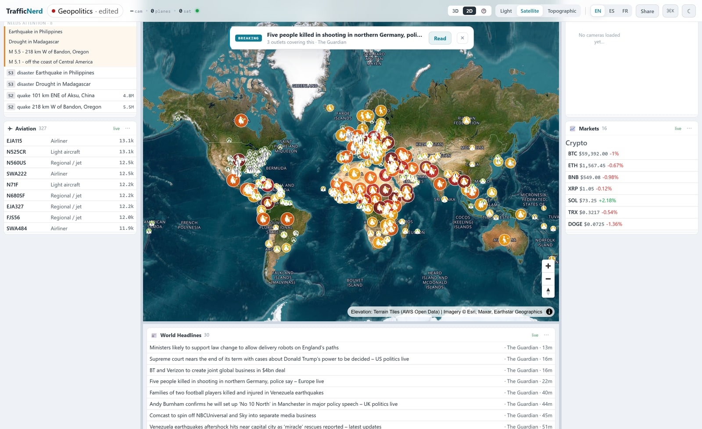
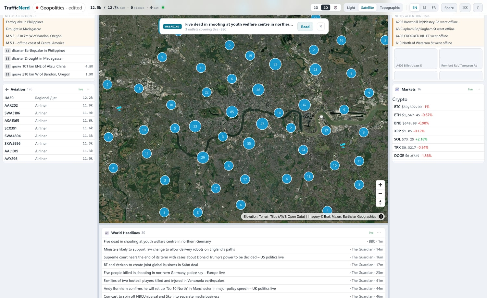
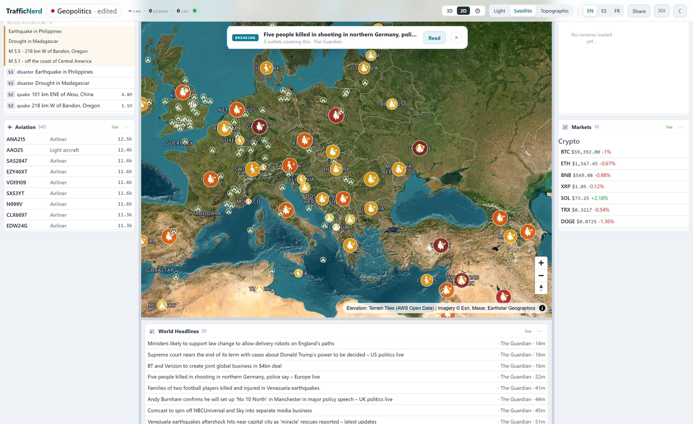
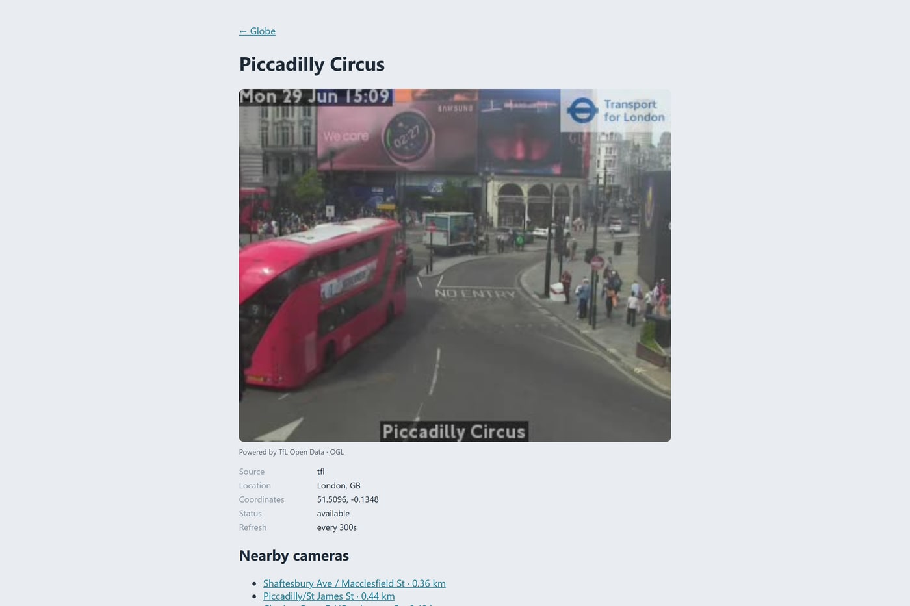
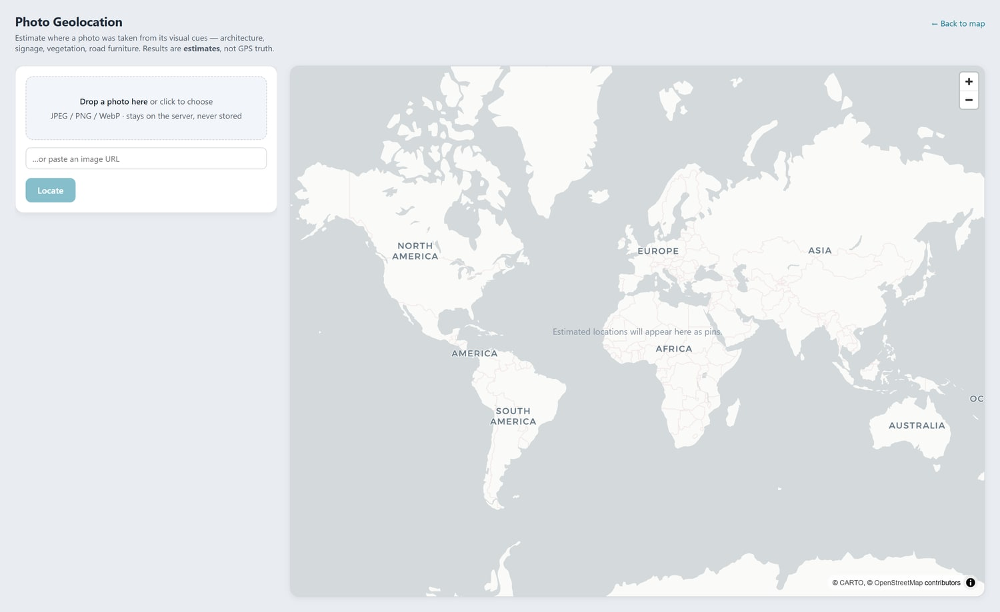

<p align="center">
  
</p>

<h1 align="center">TrafficNerd</h1>
<p align="center">A live satellite globe of the world's open traffic cameras, aircraft, satellites and global signals, in the browser.</p>

<p align="center">
  <a href="https://traffic-nerd-v2.vercel.app"></a>
  
  
  
  
</p>

Spin a satellite Earth and watch ~12,000 government traffic cameras, live aircraft and orbiting satellites light up on one MapLibre globe. The globe morphs continuously into a flat satellite or street map as you zoom, so you can click any camera for its live image or HLS video, or any country for a quick dossier. On top sit 33 opt-in "global signal" layers (earthquakes, wildfires, disaster alerts, conflict, undersea cables, cyber threats and more), each a per-hazard pin on the map, arranged in a customisable widget console with live news, markets and a photo-geolocation tool. Every feed is sourced from data published for public reuse, is keyless or uses your own key, and carries its required attribution.

This is the web rewrite of [TrafficNerd v1](https://github.com/011-sam-110/TrafficNerd), which was a London-only terminal app.

_Status: live on Vercel (link above) and runs locally with no setup. Every core feed is keyless and live; a handful of extras need your own free key and stay dormant without one (global webcams via Windy; NASA FIRMS fires; ACLED conflict events; OpenAQ stations; ReliefWeb; ENTSO-E grid; AIS ships). Best-accuracy photo geolocation wants a local GeoCLIP sidecar, otherwise it falls back to a vision-AI estimate. The clickable-country dossier is a placeholder today (identity facts only; live advisory and instability data are the next step), weather radar is stubbed as "soon", and route planning is in progress. Coverage is honest but partial and depends on upstream public APIs staying open._

## ✨ Features

- **One continuous globe to map engine** - a single MapLibre `projection: 'globe'` instance morphs a spinning satellite Earth into a flat satellite or street map on zoom: no cross-fade seam, one WebGL context. Satellite imagery is the default basemap, with Light and Topographic a tap away and an optional 3D-terrain mode.
- **~12,000 live cameras across 11 keyless networks** - government road cameras across the UK, US, Canada, Finland, New Zealand, Iceland and Estonia (TfL, Caltrans, SCDOT, Finland Digitraffic, Castle Rock 511, Oregon TripCheck, DriveBC, NZTA, Iceland, Estonia, Traffic Scotland), clustered on the map and each opening its live still or HLS video.
- **Aircraft and satellites** - live ADS-B aircraft from [adsb.lol](https://adsb.lol) with breadcrumb trails (call-sign and category enriched via adsbdb), and satellites propagated in the browser from CelesTrak TLEs with SGP4 (`satellite.js`).
- **33 global signal layers** - opt-in and attributed, most keyless, each drawn as its own hand-made hazard pin: earthquakes (USGS, EMSC), wildfires / volcanoes / storms / floods (NASA EONET), GDACS disaster alerts, tropical cyclones, aurora and space weather (NOAA), rocket launches, undersea cables, GPS jamming, nuclear plants, airports, ports, GDELT conflict and protests, weather and air quality (Open-Meteo), UK street crime (data.police.uk), cyber command-and-control and ransomware (abuse.ch, Ransomware.live), forced displacement (UNHCR), food security (WFP) and more. Adding one is a single adapter file plus a fixture test.
- **Clickable countries** - bundled Natural Earth borders outline every country and label it on the satellite and topographic basemaps (which carry no labels of their own); clicking one opens a country dossier with its flag, ISO code, region and population.
- **A customisable widget console** - a fixed center stage (3D globe, 2D map or a world clock) framed by resizable, collapsible panels of live monitor cards (Aviation, Events, Cameras, Markets, News, Space). A Cmd-K catalog adds any of them, nine field presets (World, Aviation Ops, Disaster Response, Security & Conflict, Cyber & Infrastructure, Climate & Environment, Space & Orbital, Markets & Newsroom, Maritime) rearrange the whole console in one tap, and any layout is shareable as a `?c=` URL.
- **Live world context** - a breaking-news banner and scrolling headline ticker (public RSS) plus a crypto markets panel (CoinGecko).
- **Photo geolocation** (`/locate`) - estimate where a photo was taken from its visual cues and plot ranked candidates on their own map, with every result labelled an estimate, not GPS truth.
- **Closed, SSRF-safe proxies** - `/api/proxy` takes a camera *id* (never an arbitrary URL), resolves it behind a host allowlist, upgrades mixed content and caches at each source's refresh cadence; `/api/hls` fronts the live video streams the same way.

## 📸 Screenshots

| ~12,000 cameras over London on satellite imagery | Country borders, names and live hazard pins |
|---|---|
|  |  |
| Every camera opens its live image, attributed | `/locate`: estimate where a photo was taken, keyless |
|  |  |

## 🛠 Stack

Next.js 15 (App Router) · TypeScript · React 19 · MapLibre GL JS v5 · hls.js · satellite.js (SGP4) · h3-js · zod · Vitest · Playwright · deployed on Vercel.

Data and tiles are keyless: TfL · Caltrans · SCDOT · Finland Digitraffic · Castle Rock 511 · Oregon TripCheck · DriveBC · NZTA · Iceland · Estonia · Traffic Scotland · adsb.lol · adsbdb · CelesTrak · USGS · EMSC · NASA EONET · GDACS · NOAA · Open-Meteo · GDELT · data.police.uk · abuse.ch · CoinGecko · Esri World Imagery · CARTO Positron · OpenTopoMap · Natural Earth · AWS Terrain Tiles.

## 🚀 Run

```bash
npm install
npm run dev                 # http://localhost:3000
# production build:
npm run build && npm run start
npm test                    # 520 unit tests (Vitest)
```

No API keys are required for the core map. Optional keys unlock the dormant extras (`WINDY_KEY` for global webcams, plus FIRMS / ACLED / OpenAQ / ReliefWeb / ENTSO-E / AIS), and a local GeoCLIP sidecar improves `/locate` accuracy.

## 🧠 How it works

```
app/page.tsx ── components/WorldMap.tsx ──── one maplibregl.Map (projection: 'globe')
                  │   basemap registry (Satellite default / Light / Topographic) + 3D terrain
                  │   per-hazard signal icons + clickable Natural Earth country layer
                  ├── lib/sources/*     one adapter per camera feed -> Camera (zod), merged + cached
                  ├── lib/signals/*     one adapter + one registry entry per signal layer
                  │                      (points, lines and polygons, all data-driven)
                  ├── lib/planes/*      adsb.lol live ADS-B + adsbdb enrichment + breadcrumb trails
                  ├── lib/satellites/*  CelesTrak TLE -> SGP4 propagation on a client tick
                  ├── lib/geo/*         Natural Earth country borders, names and dossier builder
                  ├── lib/proxy/*       closed image + HLS proxies (host allowlist, per-source cache)
                  └── lib/console/*     the widget console (center stage + monitor-card panels,
                                         presets, shareable ?c= layouts)
API routes:  /api/cameras · /api/planes · /api/satellites · /api/signals/[id]
             /api/proxy · /api/hls · /api/geolocate · /api/news · /api/markets · /api/near
```

Adding a camera source or a signal layer is one adapter file plus a fixture test; the normalization layer, and the proxy that fronts every image, are the core of the project.
