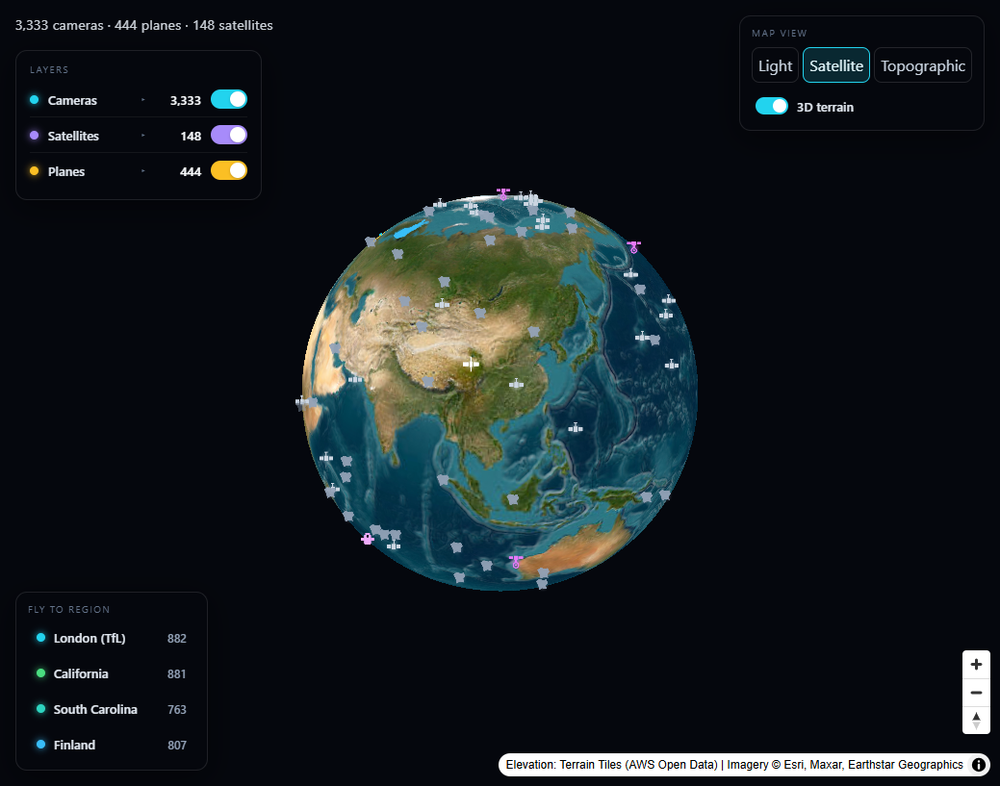

<p align="center">
  
</p>

<h1 align="center">TrafficNerd</h1>
<p align="center">A live 3D globe of the world's open traffic cameras, aircraft and satellites — in the browser.</p>

<p align="center">
  
  
  
  
</p>

Spin a real-imagery Earth and watch ~3,300 government traffic cameras, live aircraft and orbiting satellites light up on one MapLibre globe. The globe morphs continuously into a flat satellite/street map as you zoom in — click any camera for its live image or HLS video. Everything is sourced only from feeds published for public reuse, and every image carries its required attribution.

This is the web rewrite of [TrafficNerd v1](https://github.com/011-sam-110/TrafficNerd) (a London-only terminal app), being rebuilt into a calm, honest "world monitor" — see the [Roadmap](#-roadmap).

## ✨ Features

- **One continuous globe → map engine** — a single MapLibre `projection:'globe'` instance morphs a spinning 3D Earth into a flat satellite/street map on zoom: no cross-fade seam, one WebGL context.
- **A live multi-layer world** — ~3,330 traffic cameras (London TfL, California, South Carolina, Finland), live aircraft from [adsb.lol](https://adsb.lol) with breadcrumb trails, and satellites propagated client-side from CelesTrak TLEs (SGP4, via `satellite.js`).
- **Live camera video** — US cameras stream HLS through a closed `/api/hls` proxy; others show auto-refreshing stills — each with its mandatory source attribution.
- **Switchable map views** — Satellite imagery / Light / Topographic basemaps, plus a 3D-terrain toggle backed by keyless AWS terrarium elevation tiles.
- **A closed, SSRF-safe image proxy** — `/api/proxy` takes a camera *id* (never an arbitrary URL), resolves it behind a host allowlist, upgrades mixed content, and caches at each source's refresh cadence.
- **Layer & region controls** — toggle cameras / planes / satellites, filter cameras by region or live-video-only, and fly to each covered region.

## 🛠 Stack

Next.js 15 (App Router) · TypeScript · React 19 · MapLibre GL JS v5 · hls.js · satellite.js (SGP4) · zod · Vitest · Playwright.

Data & tiles are keyless: TfL · Caltrans · SCDOT · Fintraffic Digitraffic · adsb.lol · CelesTrak · Esri World Imagery · CARTO Positron · OpenTopoMap · AWS Terrain Tiles.

## 🚀 Run

```bash
npm install
npm run dev                 # http://localhost:3000
# production build:
npm run build && npm run start
npm test                    # 90 unit tests (Vitest)
```

No API keys are required for the current data sources.

## 🧠 How it works

```
app/page.tsx ── WorldMap.tsx ───────── one maplibregl.Map (projection: 'globe')
                  │   basemap registry (Satellite / Light / Topo) + terrain
                  ├── lib/sources/*   one adapter per feed → Camera/WorldObject (zod)
                  ├── lib/proxy/*     closed image + HLS proxies (host allowlist, cache)
                  └── lib/satellites/* CelesTrak TLE → SGP4 propagation on a client tick
API routes:  /api/cameras · /api/planes · /api/satellites · /api/proxy · /api/hls
```

Adding a camera source is one adapter file plus a fixture test; the normalization layer (and the proxy that fronts every image) is the core of the project.

## 🗺 Roadmap

Runs locally; **not deployed yet.** Active rewrite toward a full "world monitor" + OS-Maps-style outdoor features — the planning, 26 feature specs and source research live under `docs/superpowers/`.

- [x] **M1** — single MapLibre globe engine (replaces the old react-globe.gl + flat-map hybrid)
- [~] **M2** — calm light console shell + map-view switcher *(in progress)*
- [ ] More keyless camera coverage (~20k across more countries) + Windy global webcams
- [ ] "Cameras near me" + place search, with honest per-region coverage
- [ ] Route planning with elevation profile (OS-Maps-style), GPX import
- **Known limitation:** coverage is honest but partial — live/congestion data exists only where a source provides it, and the app depends on upstream public APIs staying open.
