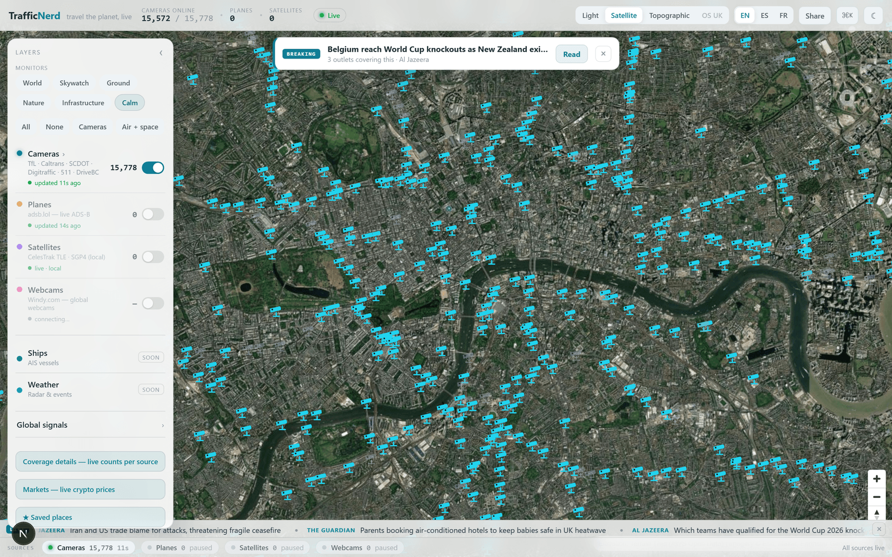
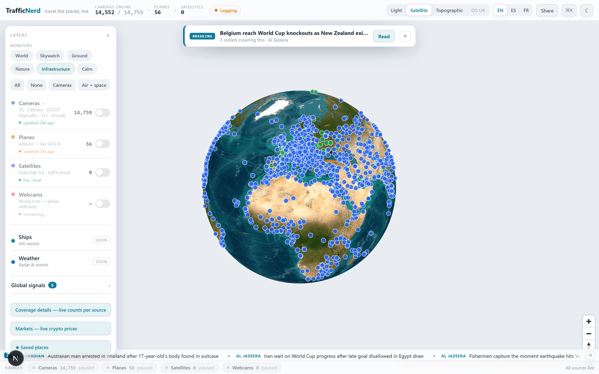
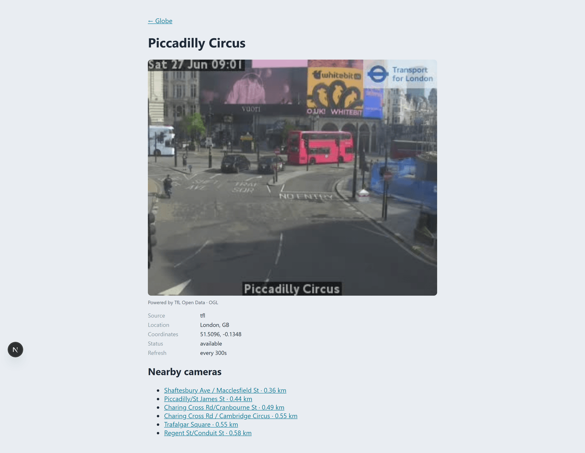
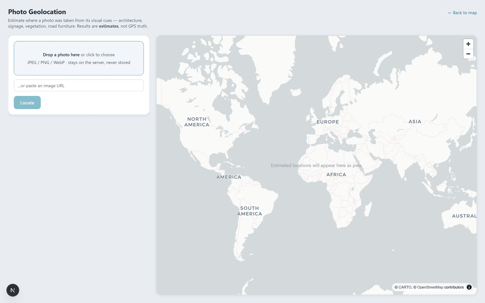

<p align="center">
  
</p>

<h1 align="center">TrafficNerd</h1>
<p align="center">A live 3D globe of the world's open traffic cameras, aircraft, satellites and global signals, in the browser.</p>

<p align="center">
  
  
  
  
</p>

Spin a real-imagery Earth and watch ~16,000 government traffic cameras, live aircraft and orbiting satellites light up on one MapLibre globe. The globe morphs continuously into a flat satellite or street map as you zoom in, so you can click any camera for its live image or HLS video. On top of that sit 21 opt-in "global signal" layers (earthquakes, wildfires, disaster alerts, undersea cables, airports, weather, crime, cyber threats and more), a calm worldmonitor-style console, live news and a photo-geolocation tool. Every feed is sourced from data published for public reuse, is keyless, and carries its required attribution.

This is the web rewrite of [TrafficNerd v1](https://github.com/011-sam-110/TrafficNerd), which was a London-only terminal app.

_Status: runs locally, not deployed. Every data source is keyless and live except two optional extras (global webcams need a Windy key; best-accuracy photo geolocation needs a local GeoCLIP sidecar, otherwise it falls back to a vision-AI estimate). Ships (AIS) and weather radar are stubbed as "soon", an OS UK basemap is wired but disabled, and route planning is still in progress. Coverage is honest but partial and depends on upstream public APIs staying open._

## ✨ Features

- **One continuous globe to map engine** - a single MapLibre `projection: 'globe'` instance morphs a spinning 3D Earth into a flat satellite or street map on zoom: no cross-fade seam, one WebGL context.
- **~16,000 live cameras across 11 keyless sources** - government road cameras across the UK, US, Canada, Finland, New Zealand, Iceland and Estonia (TfL, Caltrans, SCDOT, Finland's Digitraffic, nine Castle Rock 511 systems, Oregon TripCheck, DriveBC, NZTA, Iceland, Estonia, Traffic Scotland), clustered on the map and each opening its live still or HLS video.
- **Aircraft and satellites** - live ADS-B aircraft from [adsb.lol](https://adsb.lol) with breadcrumb trails (call-sign and category enriched via adsbdb), and satellites propagated in the browser from CelesTrak TLEs with SGP4 (`satellite.js`).
- **21 global signal layers** - opt-in, keyless and attributed: earthquakes (USGS), wildfires / volcanoes / storms / floods (NASA EONET), GDACS disaster alerts, aurora (NOAA), rocket launches, undersea cables, GPS jamming, nuclear plants, airports, ports, GDELT conflict and protests, city weather and air quality (Open-Meteo), UK street crime (data.police.uk), cyber command-and-control and ransomware (abuse.ch, Ransomware.live), and forced displacement (UNHCR). Adding one is a single adapter file plus a fixture test.
- **A calm console shell** - one-tap monitor presets (World, Skywatch, Ground, Nature, Infrastructure, Calm), a grouped layer rail, a Cmd-K command palette, a recency time-window filter, saved places, EN / ES / FR interface language, light / dark, a basemap switcher (Light / Satellite / Topographic) and a 3D-terrain toggle.
- **Live world context** - a breaking-news banner and scrolling headline ticker (public RSS) plus a crypto markets panel (CoinGecko).
- **Photo geolocation** (`/locate`) - estimate where a photo was taken from its visual cues and plot ranked candidates on their own map, with every result labelled an estimate, not GPS truth.
- **Closed, SSRF-safe proxies** - `/api/proxy` takes a camera *id* (never an arbitrary URL), resolves it behind a host allowlist, upgrades mixed content and caches at each source's refresh cadence; `/api/hls` fronts the live video streams the same way.

## 📸 Screenshots

| Zoom to a flat satellite map: ~16,000 cameras over London | Global signals: the Infrastructure monitor |
|---|---|
|  |  |
| Every camera opens its live still or HLS video, attributed | `/locate`: estimate where a photo was taken, keyless |
|  |  |

## 🛠 Stack

Next.js 15 (App Router) · TypeScript · React 19 · MapLibre GL JS v5 · hls.js · satellite.js (SGP4) · h3-js · zod · Vitest · Playwright.

Data and tiles are keyless: TfL · Caltrans · SCDOT · Finland Digitraffic · Castle Rock 511 · Oregon TripCheck · DriveBC · NZTA · Iceland · Estonia · Traffic Scotland · adsb.lol · adsbdb · CelesTrak · USGS · NASA EONET · GDACS · NOAA · Open-Meteo · GDELT · data.police.uk · CoinGecko · Esri World Imagery · CARTO Positron · OpenTopoMap · AWS Terrain Tiles.

## 🚀 Run

```bash
npm install
npm run dev                 # http://localhost:3000
# production build:
npm run build && npm run start
npm test                    # 283 unit tests (Vitest)
```

No API keys are required for the core map. Optional: set `WINDY_KEY` to enable the global webcams layer, and run a local GeoCLIP sidecar for best-accuracy `/locate` (it falls back to a vision-AI estimate without one).

## 🧠 How it works

```
app/page.tsx ── components/WorldMap.tsx ──── one maplibregl.Map (projection: 'globe')
                  │   basemap registry (Light / Satellite / Topographic) + 3D terrain
                  ├── lib/sources/*     one adapter per camera feed → Camera (zod), merged + cached
                  ├── lib/signals/*     one adapter + one registry entry per signal layer
                  │                      (points, lines and polygons, all data-driven)
                  ├── lib/planes/*      adsb.lol live ADS-B + adsbdb enrichment + breadcrumb trails
                  ├── lib/satellites/*  CelesTrak TLE → SGP4 propagation on a client tick
                  ├── lib/proxy/*       closed image + HLS proxies (host allowlist, per-source cache)
                  └── lib/shell/*       persisted UI stores (layers, monitors, time-window, saved places)
API routes:  /api/cameras · /api/planes · /api/satellites · /api/signals/[id]
             /api/proxy · /api/hls · /api/geolocate · /api/news · /api/markets · /api/near
```

Adding a camera source or a signal layer is one adapter file plus a fixture test; the normalization layer, and the proxy that fronts every image, are the core of the project.
