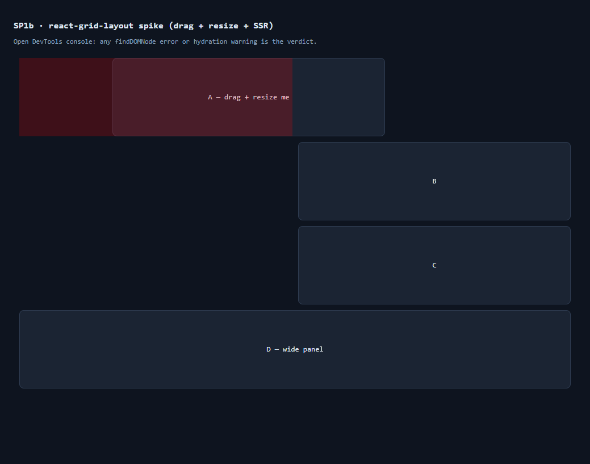

# SP1b Spike — react-grid-layout under React 19 + Next 15

**Verdict: ✅ GO** with `react-grid-layout@2.2.3`. It mounts, hydrates, and drags
cleanly under React 19 / Next 15.5.19. The one surprise: **RGL 2.x is a full API
rewrite** — the integration is hooks-based, not the 1.x `WidthProvider` API the
SP1a design spec assumed. Details below.



## Method (de-risked, not hand-waved)

Run in an **isolated git worktree** off `origin/main` (`8f7c180`, post-SP1a) so
the shared working dir / lockfile were never touched:

1. Fresh `npm install` + `react-grid-layout@2.2.3`.
2. Minimal `/rgl-spike` route: a **Server Component** page SSR-rendering a
   client `ResponsiveGridLayout` (4 draggable + resizable tiles).
3. `npm run build` → `next start` (production, not dev).
4. Loaded in a real headless browser (Playwright), inspected the **console**,
   and **fired a drag** (`mousedown`+`mousemove`) to exercise react-draggable's
   DOM-node resolution path.

Versions exercised: `react@19.0.0`, `react-dom@19.0.0`, `next@15.5.19`,
`react-grid-layout@2.2.3`, `react-draggable@4.7.0`, `react-resizable@3.2.0`.

## Results

| Risk | Result | Evidence |
|------|--------|----------|
| **React 19 removed `ReactDOM.findDOMNode`** — react-draggable's classic crash | ✅ PASS | Drag-start fired (`react-draggable-dragging` class applied) with **0 console errors**. RGL 2.2.3 passes `nodeRef` to `DraggableCore`, so the `findDOMNode` fallback (still present in the bundle, 15×) is dead code. |
| **SSR hydration mismatch** (1.x `WidthProvider` measures width client-side) | ✅ PASS | **0 hydration warnings.** 2.x's `useContainerWidth()` returns a `mounted` flag; gating the grid on it means server + first client paint render an empty container → match by construction. |
| **Build** | ✅ PASS | `npm run build` clean; `/rgl-spike` **pre-rendered as static** (`○`), 19 kB route / 122 kB First Load. |
| **Interactivity** | ✅ PASS | 4 tiles rendered, positioned via CSS transforms, each `react-draggable`-wrapped with a `react-resizable-handle`. Drag-start engages. |
| **Supply chain** | ✅ OK | RGL adds **no critical/high runtime vulns** (those in the project are dev-only/pre-existing). Runtime chain: rgl → react-draggable + react-resizable; 2 moderate audit findings. |

## ⚠️ Critical finding — RGL 2.x ≠ 1.x (the spec assumed 1.x)

The SP1a design spec referenced the `WidthProvider(Responsive)` HOC pattern.
That API **moved**. For SP1b, build against the 2.x API:

- **Hooks-first:** `useContainerWidth`, `useGridLayout`, `useResponsiveLayout`.
- **Components:** `GridLayout` (needs `width`; `cols`/`rowHeight`/`margin` live in
  `gridConfig`) and `ResponsiveGridLayout` (needs `width`; exposes `cols`,
  `rowHeight`, `breakpoints`, `layouts`, `margin` directly).
- **Drag/resize via config objects**, not booleans: `dragConfig`/`resizeConfig`
  (both `enabled: true` by default; `resize` default handle `['se']`). Per-item
  `isDraggable`/`isResizable` overrides still exist on layout items.
- **`WidthProvider` + `ResponsiveReactGridLayout` (1.x API) still ship** under the
  `react-grid-layout/legacy` subpath — an escape hatch if we want the familiar
  API, but the new one is preferred and SSR-cleaner.
- **Do NOT install `@types/react-grid-layout`** — the DefinitelyTyped package
  types the **1.x** API and actively misleads (it falsely "exports"
  `WidthProvider` from the main entry). 2.x ships its **own** types via an
  `exports` map (`.`, `./core`, `./react`, `./legacy`, `./extras`).
- **CSS:** import `react-grid-layout/css/styles.css` +
  `react-resizable/css/styles.css`.

## Recommended SSR-safe pattern for SP1b

```tsx
"use client";
import { ResponsiveGridLayout, useContainerWidth } from "react-grid-layout";
import "react-grid-layout/css/styles.css";
import "react-resizable/css/styles.css";

export function Workspace() {
  const { width, containerRef, mounted } = useContainerWidth();
  return (
    <div ref={containerRef}>
      {mounted && (
        <ResponsiveGridLayout
          width={width}
          layouts={layouts}            // keep in component state for the draft editor
          onLayoutChange={onChange}    // REQUIRED or a controlled grid reverts after drop
          cols={{ lg: 12, md: 10, sm: 6, xs: 4, xxs: 2 }}
          rowHeight={64}
        >
          {panels.map(p => <div key={p.key}>{/* PanelHost render */}</div>)}
        </ResponsiveGridLayout>
      )}
    </div>
  );
}
```

## Caveats / follow-ups for the SP1b build

1. **Controlled-layout revert:** passing `layouts` without `onLayoutChange` makes
   the grid snap back after a drop (observed in the spike). The draft-then-commit
   editor should hold the working layout in component state, update it in
   `onLayoutChange`, and persist only on **commit** (maps onto the SP1a
   `layoutOverrides` seam in `variantStore`).
2. **Trusted-pointer smoke test:** synthetic events *start* the drag but don't
   carry full pointer momentum; do a real click-drag pass in the actual
   workspace once wired.
3. **Plan amendment:** the SP1b plan must be written against the 2.x API above,
   not the 1.x `WidthProvider` shape in the SP1 design spec.

**Spike artifacts (throwaway):** branch `spike/sp1b-rgl` + worktree were used to
prove this and then removed; this document is the durable output.
